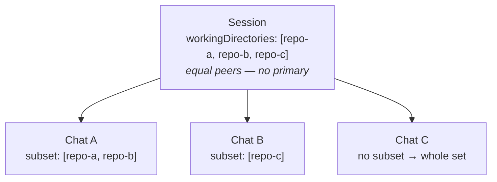
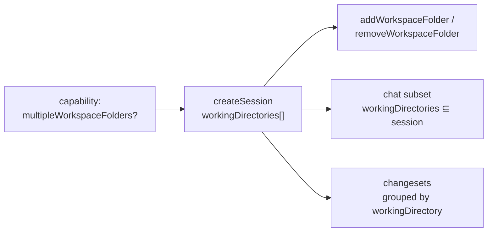
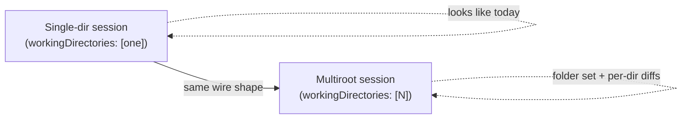

# Multiroot Sessions — Feature Overview

> A conceptual walkthrough of the multiroot-sessions feature for presentations
> and design discussion, plus a concise map of the concrete protocol surface so
> reviewers can connect the framing to the actual `types/` changes. Like the
> [multi-chat overview](./multi-chat.md), it explains **what** the capability is
> and **why** it exists before it gets to the wire shape.

---

## 1. The problem

An agent session today is scoped to **a single working directory**. The session
`workingDirectory` is the one root the agent has tool access to — the folder it
reads, edits, runs commands in, and diffs.

That model is increasingly at odds with real tasks. Work routinely spans **more
than one directory at a time**:

- A change to a service *and* the shared library it depends on, in sibling
  repositories.
- A monorepo task that touches two packages that a user keeps as separate
  checkouts.
- A migration that edits a source repo and its generated-client repo together.
- A VS Code **multi-root workspace** (`.code-workspace`) whose folders are, to
  the user, one project.

When a session can only ever see one directory, the user is forced to either
flatten everything under one root that doesn't match how they actually work, or
run **disconnected sessions** per folder that lose their shared context (the same
task, the same conversation, the same configuration).

**The feature in one sentence:** let a single session grant its agent tool
access to *multiple working directories* — equal peers, no privileged
"primary" — so that cross-directory work can be represented and driven as one
coherent whole.

---

## 2. The mental model

Three roles, nested:

- **A session owns a *set* of working directories.** They are **equal peers** —
  there is no "primary" and no "additional." The session is the boundary of what
  the agent may touch: every directory in the set is fair game, nothing outside
  it is.

- **A chat operates in a *subset* of the session's directories.** A single
  thread of work usually focuses on part of the session. A chat may pin itself to
  one directory (or a few); when it pins nothing, it sees the session's whole
  set.

- **Changes are grouped *by directory*.** The file changes an agent produces are
  surfaced as one changeset per directory, each carrying which directory it
  belongs to — a flat list per root, not a nested tangle.

> One session, many equal directories. Each chat narrows to a subset. Changes
> group by directory.



A helpful analogy: the session is a **VS Code multi-root workspace**, its
directories are the **workspace folders**, and a chat is a **task** that may care
about only some of those folders.

---

## 3. Where this feature lives in the stack

As with multi-chat, this feature is a **window** onto what the harness does — not
the mechanism itself.

```
   ┌─────────────┐                         ┌──────────────────────────────┐
   │  UI client  │   ◄── feature layer ──► │   Agent harness              │
   │ (the app a  │  directory set, per-    │   ── grants the agent tool   │
   │  user sees) │  chat subset, per-dir   │      access to N directories │
   └─────────────┘  changesets             │   ── roots the process /     │
                                           │      applies path grants     │
                                           └──────────────────────────────┘
```

- **The harness layer** is where directory access actually takes effect: rooting
  the agent process, applying filesystem path grants, isolating worktrees. How a
  backend enforces "the agent may touch these three folders" is its own business.

- **The feature/interoperability layer** (where this feature lives) lets a UI
  *declare and observe* that set — pick the directories at session creation,
  add/remove them later, narrow a chat to a subset, and render changes grouped by
  directory.

**The feature is about representation and control, not access enforcement.** It
gives clients a vocabulary for "this session works across these folders"; the
harness decides how that is realized.

---

## 4. What the feature gives you

At the feature level, multiroot sessions introduce a small, additive set of
capabilities:

1. **A capability gate.** An agent advertises whether it supports more than one
   working directory. Clients check it before offering any multiroot affordance;
   agents that don't support it behave exactly as today.

2. **A session directory set.** A session is created with a *list* of working
   directories, all equal peers. A single-directory session is just the list of
   length one.

3. **Add / remove after start.** Directories can be granted or revoked while the
   session runs. Removal is modelled as "reconfigure to this reduced set" — there
   is no fragile single-remove primitive underneath.

4. **A per-chat subset.** Each chat may narrow to a subset of the session's
   directories (every entry must be one of the session's). A chat that narrows
   nothing operates against the whole set.

5. **Changes grouped by directory.** The session surfaces one changeset per
   working directory, each tagged with the directory it covers — so a UI can show
   "changes in repo-a / repo-b" without inventing arrays-of-arrays.

6. **Graceful backward compatibility.** The old singular `workingDirectory`
   fields are kept as a deprecated single-directory shorthand, so clients that
   predate this feature keep working unchanged.



---

## 5. Worked example: a cross-repo change

A user asks an agent to update an API and the client library that consumes it,
kept as two separate checkouts.

| What the user / harness does | How the feature represents it |
| --- | --- |
| User starts a task over `api/` and `client/` | A session with `workingDirectories: [api, client]`. |
| Agent edits both repos | The agent has tool access to both directories, equal peers. |
| User opens a focused thread on just the client | A chat pinned to `workingDirectories: [client]`. |
| Agent later needs the shared `protos/` repo too | `addWorkspaceFolder(protos)` → set becomes `[api, client, protos]`. |
| User reviews the diff | Three changesets, one per directory, each tagged with its `workingDirectory`. |
| The `protos/` work turns out unnecessary | `removeWorkspaceFolder(protos)` → set reconfigures back to `[api, client]`. |

The session stays one coherent conversation and one shared configuration
throughout — no juggling three disconnected sessions.

---

## 6. What this feature deliberately is *not*

- **It is not a permissions / sandboxing model.** The directory set says *which
  folders the session works across*, not a fine-grained ACL of what the agent may
  read vs. write. Enforcement and least-privilege policy stay a harness concern.

- **It is not per-file or per-glob scoping.** The unit is a working directory (a
  root), not arbitrary path patterns within it.

- **It does not introduce a primary.** All directories are peers. Anything that
  needs "the main one" (e.g. an old client) reads the deprecated singular field,
  which is just a shorthand — not a semantic primary.

- **It is not multi-root *chats as sub-sessions*.** A chat narrowing to a subset
  is still one thread under one session's trust and identity. Independent agents
  with their own lifecycle remain the separate, future sub-session concept.

These omissions keep the feature small and composable. Richer path policy,
per-tool scoping, or workspace-level config are natural *future* axes that can
layer on without breaking this shape.

---

## 7. Why this shape

- **Equal peers, no primary.** The user's mental model ("these folders are my
  project") has no privileged root. Encoding a primary would create a confusing
  "what's the relationship between primary and secondary?" question with no good
  answer — so the model refuses it.

- **Session owns, chat subsets.** The broadest scope lives where it is shared
  (the session); a chat only ever *narrows*, never widens. This keeps the
  invariant simple: a chat's directories are always ⊆ the session's.

- **Changes group by directory, not arrays-of-arrays.** Reusing the existing
  changeset catalogue — one entry per directory, tagged with its
  `workingDirectory` — keeps each changeset a flat file list and avoids a new
  nested shape.

- **Additive and capability-gated.** Every new field is optional; the commands
  are gated behind a capability plus a version handshake. A single-directory
  harness is untouched; a multiroot harness simply lights up more directories.



---

## 8. Protocol surface (for reviewers)

The concrete, additive changes that back the framing above. Full detail lives in
the [State Model](/guide/state-model#multiroot-sessions) and
[Changesets](/guide/changesets) guides; this is the reviewer's map. Target spec
version: **0.6.0**.

**Capability** — `AgentCapabilities`

- `multipleWorkspaceFolders?: MultipleWorkspaceFoldersCapability` — presence
  (`{}`) signals support. When absent, clients MUST NOT send the add/remove
  commands and MUST NOT supply more than one directory anywhere.

**Session** — `CreateSessionParams`, `SessionMetadata` (→ `SessionState` +
`SessionSummary`)

- `workingDirectories?: URI[]` — the session's equal-peer directory set.
- `workingDirectory?: URI` — **deprecated**; single-directory shorthand / mirror
  of the first entry, retained for old clients.

**Runtime mutation** — new commands on the session channel

- `addWorkspaceFolder({ folder })` → `WorkspaceFolderResult { directories }`
- `removeWorkspaceFolder({ folder })` → `WorkspaceFolderResult { directories }`
  (idempotent; modelled as reconfigure-to-reduced-set; a server MAY refuse a
  directory it can't relinquish while live).

**Chat** — `ChatState`, `ChatSummary`, `CreateChatParams`

- `workingDirectories?: URI[]` — the chat's subset (every entry MUST be one of
  the session's). Absent → the session's whole set.
- `workingDirectory?: URI` — **deprecated** singular shorthand.

**Changes** — `Changeset`

- `workingDirectory?: URI` — the directory a changeset is scoped to; plus a
  `'directory'` `changeKind` hint. Multiroot sessions advertise one changeset per
  directory instead of nesting changes.

**Versioning / gating**

- `PROTOCOL_VERSION` bumps `0.5.1 → 0.6.0` (a capability boundary). The new
  commands are gated by the capability + the `initialize` version handshake, not
  by the action/notification introduced-in maps (they are commands, like
  `createChat`).

---

## 9. Design decisions & resolved questions

- **No primary directory.** *Resolved:* the set is equal peers. Rejected a
  "primary + additional" split because it re-introduces the confusion the user
  called out ("what's the relation between primary and secondary?").

- **Deprecate, don't remove, `workingDirectory`.** *Resolved:* the singular field
  is read by every existing client from session state; removing it would break
  single-directory sessions too. It stays as a deprecated shorthand.

- **Chat narrows to a subset (not exactly one).** *Resolved:* an earlier draft
  made a chat operate in exactly one directory; this was widened to "a subset ⊆
  the session's set," with absent meaning the whole set. Gated by the same
  capability.

- **Changes grouped by directory, on the changeset.** *Resolved:* put a
  `workingDirectory` on `Changeset` and advertise one per directory, rather than
  an array-of-arrays or a per-file `root` tag. Reuses the catalogue abstraction
  and keeps each changeset flat.

- **Removal semantics.** *Resolved:* no single-remove primitive is assumed;
  `removeWorkspaceFolder` reconfigures to the reduced set and returns it, so it is
  idempotent and safe to retry.

---

## 10. Open questions / future axes

- **Config-resolution context.** `resolveSessionConfig` /
  `sessionConfigCompletions` still take a *singular* `workingDirectory` as the
  context for resolving config (e.g. listing git branches for a worktree picker).
  Whether — and how — to make config resolution multiroot-aware is left as a
  follow-up.

- **Hard removal of the singular field.** Since the spec is pre-1.0, a future
  release *could* drop `workingDirectory` entirely. Kept deprecated for now to
  avoid breaking existing single-directory clients; promote to removal later if
  desired.

- **Per-directory rollups on the lightweight summary.** `ChangesSummary` is a
  single aggregate today. If session-list UIs want per-repo badges without
  subscribing, a `byDirectory` rollup could be added later — deferred to keep the
  summary lightweight.

- **Richer path policy.** Per-tool scoping, read-vs-write per directory, or
  glob-level rules are deliberately out of scope and can layer on top.

---

## 11. One-slide summary

- **Before:** a session is scoped to one `workingDirectory`.
- **After:** a session owns a **set of equal-peer directories**; a **chat** works
  in a **subset**; **changes group by directory**.
- **Why:** cross-directory / multi-repo / multi-root-workspace tasks are one
  coherent piece of work, not N disconnected sessions.
- **How it stays safe:** capability-gated, additive, singular field deprecated
  (not removed), removal modelled as reconfigure-to-reduced-set.
- **What it is not:** not a permission model, not per-file scoping, not a primary
  directory, not sub-sessions — those are separate/future axes.
